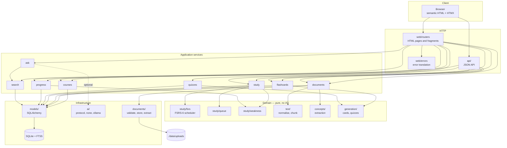
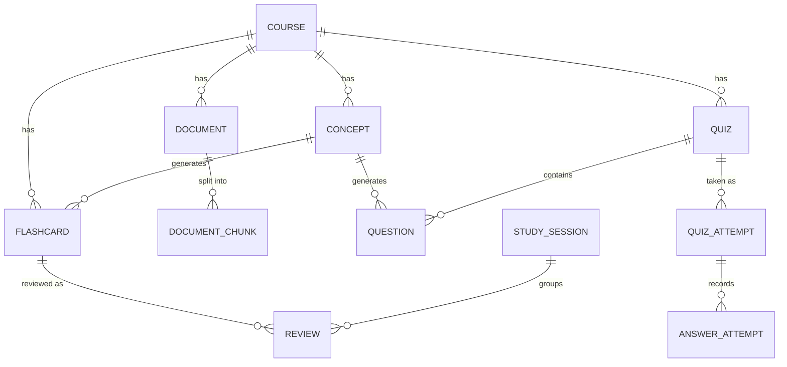

# Architecture

StudyForge is a server-rendered Python application with a pure domain core. This
document describes the layers, the rules that hold between them, and why they
are drawn where they are.

## The shape

## The layers

### Domain — `studyforge/domain/`

Pure functions and immutable value objects. **Imports nothing from SQLAlchemy,
FastAPI, or any AI provider.** Contains:

| Module | Responsibility |
|---|---|
| `study/fsrs.py` | The FSRS-6 scheduler |
| `study/queue.py` | What to study now, and in what order |
| `study/weakness.py` | Which concepts you are struggling with |
| `text/normalize.py` | Cleaning extracted text |
| `text/chunking.py` | Splitting at semantic boundaries |
| `concepts/extract.py` | Finding concepts from textual evidence |
| `generation/` | Building cards and questions from concepts |

This is the layer worth reading first. It holds every non-trivial algorithm in
the product, and because it has no I/O, every one of them is testable with
string and integer literals.

**Nothing in this layer reads the clock.** The caller passes the time. That is
what makes a schedule reproducible.

### Infrastructure — `studyforge/documents/`, `ai/`, `models/`, `db.py`

Talks to the outside world: the filesystem, a PDF parser, an HTTP endpoint, the
database.

Two boundary rules are enforced here:

- **No `pypdf` object escapes `documents/`.** Callers get plain dataclasses, so
  replacing the extraction backend touches one file.
- **A provider raises only `AIUnavailableError`.** Every idiosyncratic
  failure — timeout, connection refused, 404, 429, malformed JSON, hallucinated
  fields — becomes one predictable exception, because every caller responds the
  same way: fall back to the deterministic path and say so.

### Services — `studyforge/services/`

Own transactions and orchestration; hold the rules that span more than one
entity. **Import no FastAPI.** A service is callable and testable without a
request, which is how the ingestion pipeline and study lifecycle are tested.

Errors are raised as `NotFoundError`, `ValidationError`, `ConflictError` — each
carrying a message written for a person. Services do not know HTTP status codes.

### HTTP — `studyforge/web/`, `studyforge/api/`

Translate a request into a service call and render the result. Nothing more.
`web/errors.py` is the single place that maps a domain error to a status code
and a page.

The HTML routes are excluded from the OpenAPI schema. They are a UI, not an
API, and including them would bury the JSON contract under form handlers and
HTMX fragments.

## Key seams

### ORM ↔ scheduler

`Flashcard.to_scheduling_card()` / `.apply_scheduling()` are the only places the
persistence layer and the FSRS engine meet. The engine sees an immutable
`SchedulingCard` and returns a new one; the ORM writes it back. Neither knows
about the other.

### Retrieval ↔ generation

In *Ask my notes*, retrieval always runs and is useful alone. Generation
consumes only what retrieval produced, and its citations are validated against
the passages actually supplied. The separation is what makes "no AI configured"
a reduced answer rather than no answer.

### Deterministic ↔ AI

Every AI capability enhances a deterministic path that already works. There is
no code path where an unavailable provider produces an error page.

## Data model

Three decisions worth stating:

**No `User` table.** V1 is single-user and local-first. Authentication would be
architecture theatre; it can arrive later behind the same service layer.

**Provenance is first-class.** Generated material carries
`source_document_id`, `source_chunk_id`, `generation_method`, and the AI
provider and model where relevant. A learner can always answer *"where did this
card come from?"*

**Deleting a source document `SET NULL`s provenance rather than cascading.**
Losing the notes must not silently destroy the review history built on them.
Deleting a *course* does cascade — that is an explicit "discard this subject".

## Request lifecycle

A card review, end to end:

1. The browser POSTs `card_id`, `rating` and `session_id` via HTMX.
2. `web/routers/study.py` parses and validates the rating.
3. `services/study.record_review` loads the card, guards against a duplicate
   submission, and projects it to a `SchedulingCard`.
4. `domain/study/fsrs.Scheduler.review` returns a new card plus a full
   before/after snapshot. **No I/O, no clock, no model.**
5. The service writes the new state and a `Review` row.
6. The service rebuilds the queue and the route renders the next card.
7. The response is an HTML fragment; HTMX swaps it into `#study-card`.

## Testing strategy

| Layer | How |
|---|---|
| Domain | Pure unit tests with literals; golden vectors for FSRS |
| Infrastructure | Real files, in-process PDFs, mock HTTP transports |
| Services | Integration tests against a real temporary SQLite database |
| HTTP | `TestClient` over both HTML and JSON routes |
| Whole product | Playwright against a live server |

Each test gets its own temporary data directory and database. There is no shared
state and no ordering dependency — including in the browser tests, where each
study test creates its own course precisely because studying consumes cards.

## What was deliberately not built

- **A repository layer.** SQLAlchemy's `Session` is already that abstraction.
  Wrapping it would add indirection and remove capability.
- **Async database access.** These are indexed lookups against a local file.
  Async drivers would add real complexity to save time no user can perceive.
- **A service-locator or DI container.** Services are functions taking a
  `Session`. FastAPI's `Depends` covers the rest.
- **An event bus.** Nothing in this application needs to react to something
  else at a distance.
