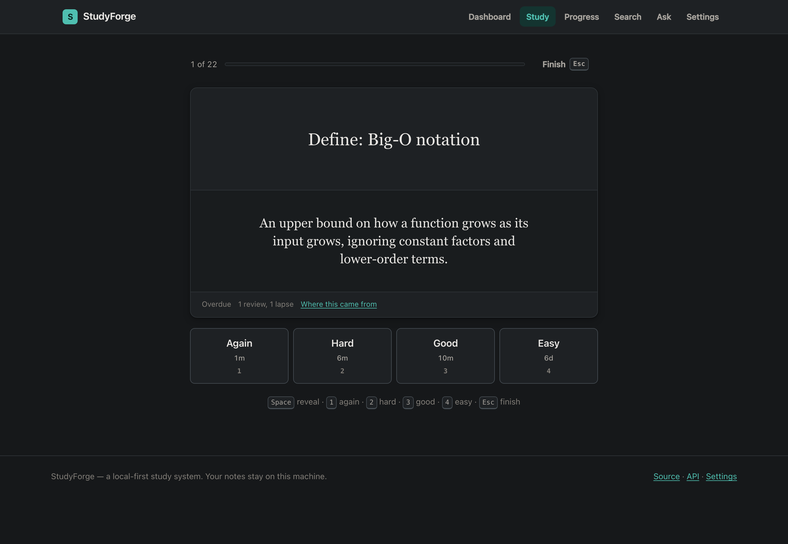
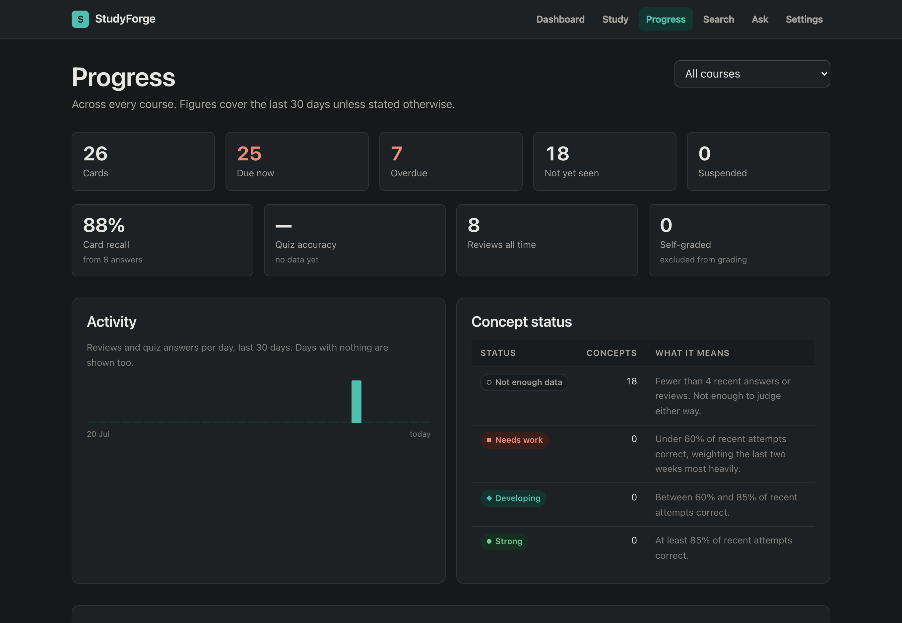
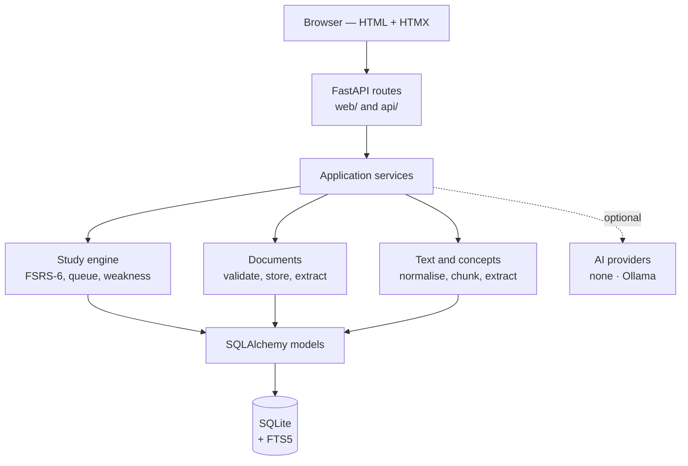
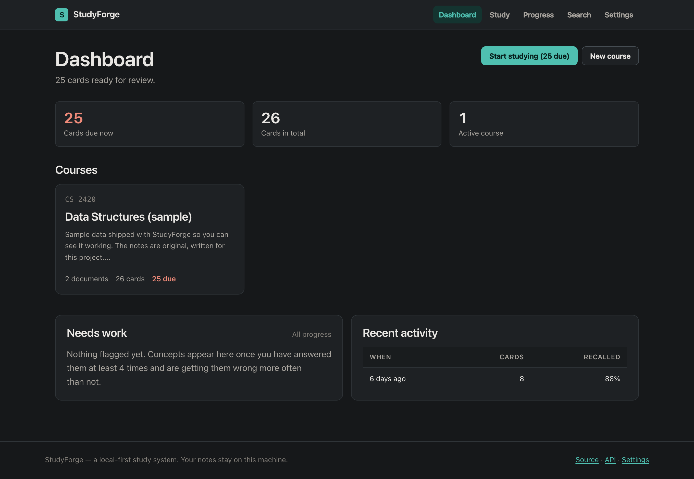
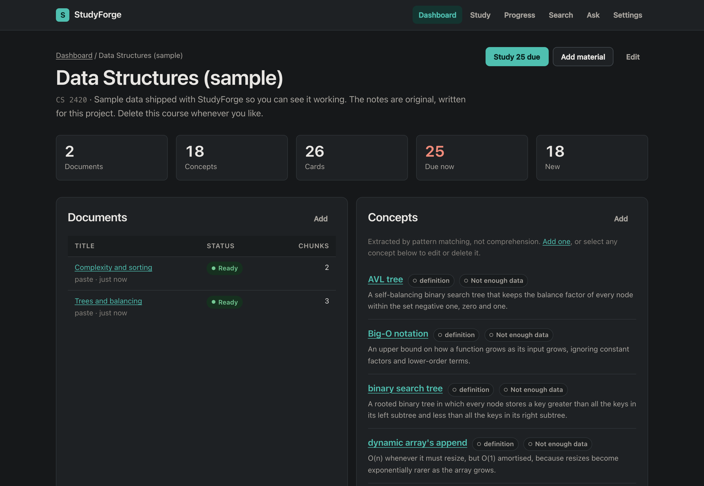
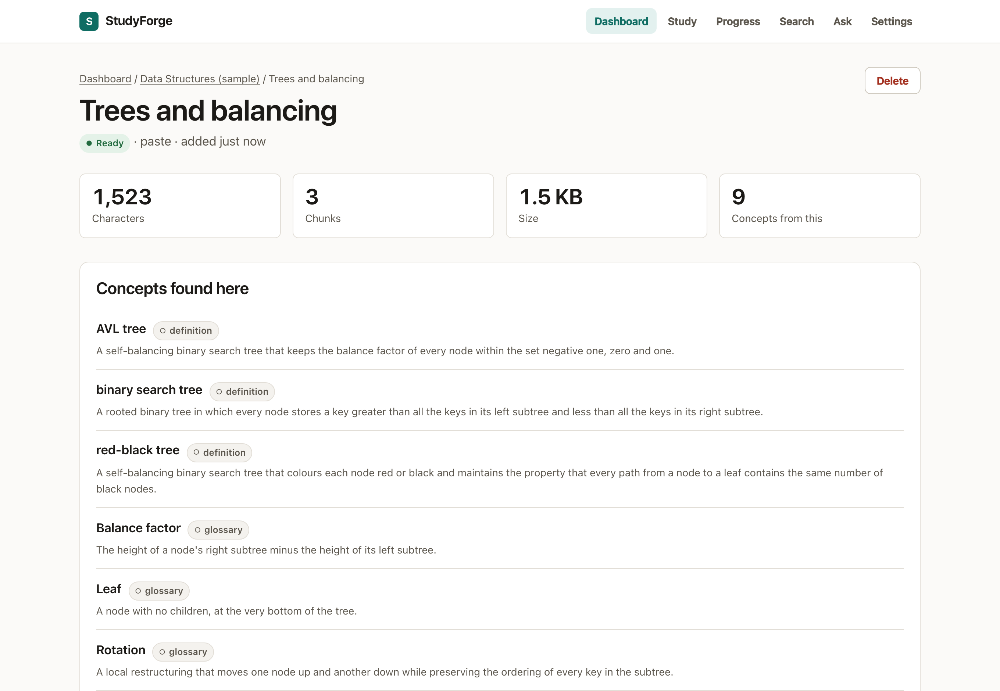
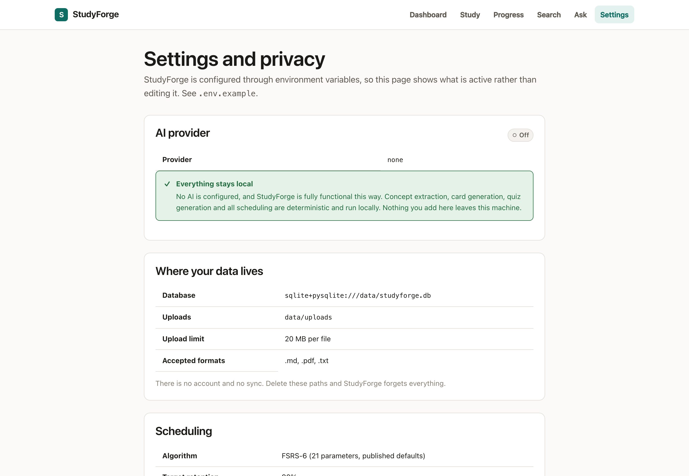

# StudyForge

**A local-first study system.** Point it at the notes and PDFs you already have,
and it extracts the concepts worth learning, builds flashcards and quizzes from
them, and schedules everything with the FSRS-6 spaced-repetition algorithm.

It runs on your machine, stores everything in one SQLite file, and is **fully
functional with no AI configured at all**.

[](https://github.com/mateoosoriodelhonte/studyforge/actions/workflows/ci.yml)
[](https://www.python.org/)
[](LICENSE)



---

## Why this exists

Most flashcard apps make you write the cards. Most "AI study tools" make you
trust a model you cannot inspect, and stop working when the API key runs out.

StudyForge takes the material you already have, does the tedious part
deterministically, and is honest about the difference between *"the document
says X is defined as Y"* and *"I understand X"*. When it does not know
something, it says so:

- a concept you have answered twice is **"Not enough data"**, not "mastered"
- every percentage shows the sample it came from — *88%, from 8 answers*
- a rate with no data renders as **—**, never as `0%`
- every generated card links back to the exact passage it came from
- every status label has a written definition, shown in the UI next to it



---

## Features

**Ingest** — paste notes, or upload `.txt`, `.md` and PDFs. Text is normalised
(hyphenation rejoined, hard wraps unwrapped, page numbers removed) and split at
semantic boundaries: headings, then paragraphs, then sentences.

**Extract** — concepts are found from evidence actually present in the text:
definition sentences, glossary lines, headings, and repeated terms, each scored
by how much that evidence proves. This is pattern matching, not comprehension,
and the UI presents concepts as candidates you can edit.

**Generate** — flashcards and quizzes from those concepts, deterministically.
The quality bar is *fewer, defensible items over more, weak ones*: a concept
with no definition produces no card, and a multiple-choice question is only
built when the course has enough sibling concepts to make the wrong answers
genuinely plausible.

**Study** — FSRS-6 spaced repetition, with a queue that prioritises overdue
reviews, then due reviews, then cards for concepts you keep getting wrong. The
rating buttons show the **real interval** each one would produce.

**Track** — review accuracy, quiz accuracy, due and overdue counts, activity
over time, and a weak-concept analysis computed from what you actually did.

**Search** — full-text across courses, documents, concepts and cards, plus
*Ask my notes*, which retrieves the relevant passages from your own material.

---

## Quick start

You need [uv](https://docs.astral.sh/uv/) and nothing else — it installs the
right Python for you.

```bash
git clone https://github.com/mateoosoriodelhonte/studyforge.git
cd studyforge
uv sync
uv run studyforge db init
uv run studyforge serve
```

Open <http://127.0.0.1:8000>. That is the whole setup — no `.env` file, no
database server, no API key.

To see it working before adding your own material:

```bash
uv run studyforge db demo
```

That adds a sample course of original notes, clearly labelled as sample data.
Delete it whenever you like.

---

## Zero-cost, and useful with no AI

StudyForge costs nothing to run and requires no account, no API key and no
hosted service. `AI_PROVIDER=none` is the default, and with it you still get:

| | |
|---|---|
| Text extraction from PDFs and text files | ✅ |
| Concept extraction | ✅ deterministic |
| Flashcard generation | ✅ deterministic |
| Quiz generation | ✅ deterministic |
| **Spaced repetition** | ✅ **never uses AI, by design** |
| Weak-concept analysis | ✅ **never uses AI, by design** |
| Full-text search and *Ask my notes* retrieval | ✅ |
| Progress tracking | ✅ |
| AI-written explanations | requires a provider |

Two of those are marked *by design* rather than *not implemented*. Scheduling
and weak-concept classification are arithmetic. Handing them to a probabilistic
text generator would make them unreproducible and untestable, so a language
model cannot reach either one.

### Optional AI

If you want it, [Ollama](https://ollama.com) runs models locally — no API cost,
and nothing leaves your machine:

```bash
ollama pull llama3.2
AI_PROVIDER=ollama uv run studyforge serve
```

StudyForge never downloads a model for you. If the configured one is missing it
says so and carries on with the deterministic path. See
[docs/AI_PROVIDERS.md](docs/AI_PROVIDERS.md).

---

## Privacy

Your notes stay on your machine. There is no account, no sync and no telemetry.
Everything lives in `./data/` — one SQLite file and your uploaded documents.
Delete that directory and StudyForge forgets everything.

**With `AI_PROVIDER=none` (the default), nothing leaves your computer at all.**

With Ollama configured, selected passages are sent to your own local Ollama
process and no further. The Settings page shows exactly what is active and what
it means. [docs/PRIVACY.md](docs/PRIVACY.md) is the precise version.

---

## Architecture



The domain layer — the FSRS engine, chunking, concept extraction, generation,
the study queue, weak-concept analysis — imports **nothing** from SQLAlchemy,
FastAPI or any AI provider. That is what makes the algorithms exhaustively
testable in isolation, and it is what guarantees no model can reach the
scheduler.

[ARCHITECTURE.md](ARCHITECTURE.md) has the layering rules and the reasoning.

### Engineering decisions

**Why SQLite?** StudyForge is local-first and must work for free with no
infrastructure. One file, no server, no connection string to configure — and
FTS5 gives full-text search with nothing extra installed. Foreign keys and WAL
are enabled explicitly at connect time, because SQLite ships with FK
enforcement *off* and the declared `ondelete` rules would otherwise be inert.

**Why HTMX rather than React?** Almost every interaction here is
server-driven: rate a card and the server decides what comes next. Shipping a
SPA framework to render server state would add a build step, a second data
model and a hydration boundary to solve a problem this application does not
have. HTMX swaps the fragment the server already knows how to render.

**Why deterministic scheduling?** A learning schedule that cannot be reproduced
cannot be tested, explained, or trusted. The FSRS implementation reads no clock
and holds no state; the caller supplies the time.

**Why is AI optional?** A study system that stops working because a provider is
down is not a study system. Every AI capability here enhances a deterministic
path that already works.

**Why no vector database?** At one person's scale, FTS5 is the right tool.
Adding embeddings and a vector store to search a few thousand paragraphs would
be architecture for its own sake.

**Why implement FSRS instead of using a library?** It is ~150 lines of
closed-form arithmetic in the hottest path of the product. Owning it means the
rules are reviewable here and covered by our own tests — and it was
[verified against the reference implementation](docs/STUDY_ENGINE.md#verification)
across 4,096 review transitions before being frozen.

---

## Stack

| Layer | Choice |
|---|---|
| Language | Python 3.12 |
| Web | FastAPI, Jinja2, HTMX, vanilla CSS |
| Data | SQLAlchemy 2 (typed), Alembic, SQLite + FTS5 |
| Validation | Pydantic 2, pydantic-settings |
| Documents | pypdf — pure Python and BSD-licensed (PyMuPDF is AGPL) |
| Tooling | uv, Ruff, mypy `--strict`, pytest |
| Browser tests | Playwright |
| CI | GitHub Actions |

---

## Tests

```bash
uv run pytest                       # 676 unit, integration and security tests
uv run pytest --cov                 # with coverage
uv run --group e2e pytest tests/e2e # 15 browser tests (needs `playwright install chromium`)
uv run ruff check . && uv run mypy  # lint and types
```

Notable coverage:

- **FSRS** — forgetting-curve identities, the four-rating ordering, the spacing
  effect, difficulty clamping under 50 consecutive failures, and golden vectors
  verified against the reference implementation
- **Security** — path traversal, content-type spoofing, XSS through every
  user-controlled field, FTS and SQL injection, error disclosure
- **Determinism** — chunking, extraction, generation and queue building all
  assert identical output across repeated runs
- **AI** — every failure mode against a mock transport. CI never contacts a
  live model.

To reproduce the scheduler verification yourself:

```bash
uv run --with fsrs python scripts/verify_fsrs_against_reference.py
```

---

## Screenshots

| | |
|---|---|
|  |  |
| **Dashboard** — what is due, and what needs work | **Course** — documents, concepts, cards, quizzes |
|  |  |
| **Document** — extraction, chunks, provenance | **Settings** — what is active, and what it means for privacy |

All screenshots use the built-in sample data.

---

## Documentation

| | |
|---|---|
| [ARCHITECTURE.md](ARCHITECTURE.md) | Layers, boundaries and the reasoning behind them |
| [docs/STUDY_ENGINE.md](docs/STUDY_ENGINE.md) | The FSRS-6 formulas, and how the implementation was verified |
| [docs/AI_PROVIDERS.md](docs/AI_PROVIDERS.md) | Configuring providers, and what each costs |
| [docs/PRIVACY.md](docs/PRIVACY.md) | Exactly what stays local and what would leave |
| [docs/LOCAL_DEVELOPMENT.md](docs/LOCAL_DEVELOPMENT.md) | Working on StudyForge |
| [docs/DEPLOYMENT.md](docs/DEPLOYMENT.md) | Running it elsewhere, and why there is no public demo |
| [SECURITY.md](SECURITY.md) | Threat model and the protections actually implemented |
| [CONTRIBUTING.md](CONTRIBUTING.md) | How to contribute |
| [CHANGELOG.md](CHANGELOG.md) | Release history |

---

## Roadmap

Deliberately out of scope for v1.0, with reasons:

- **FSRS parameter optimisation** — fitting the 21 weights to your own review
  history. Real value, but it needs a training loop and enough history to be
  meaningful. The published defaults are what FSRS itself uses until then.
- **Multi-user support** — V1 is single-user by design. Adding authentication
  to look enterprise-grade would be architecture theatre.
- **OCR for scanned PDFs** — a large dependency for output of very variable
  quality. StudyForge reports honestly that a PDF appears scanned instead.
- **Import from Anki** — genuinely useful, not yet built.
- **PostgreSQL** — the model layer is written so it would work; it is untested,
  so it is not claimed.

---

## Contributing

Issues and pull requests are welcome — see [CONTRIBUTING.md](CONTRIBUTING.md).
The short version: `uv sync`, make the change, and make sure
`uv run ruff check . && uv run mypy && uv run pytest` is clean.

## License

[MIT](LICENSE).
