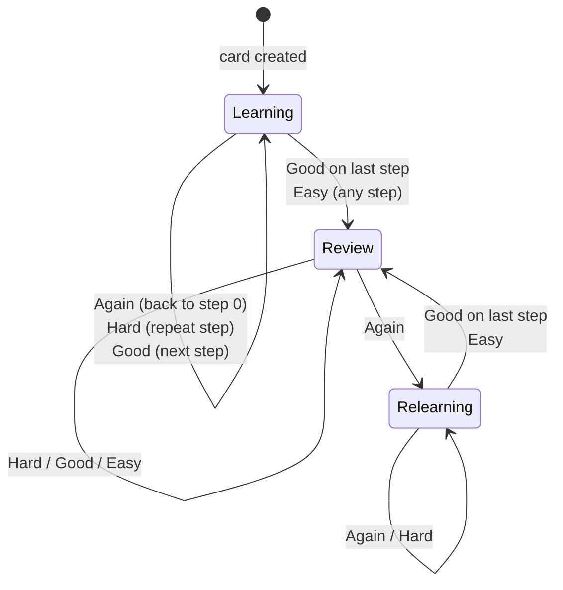

# The Study Engine

StudyForge schedules every flashcard with **FSRS-6** (Free Spaced Repetition
Scheduler, version 6). This document explains what that means, why it was
chosen over the more familiar SM-2, the actual formulas as implemented, and how
the implementation was verified.

Source: [`src/studyforge/domain/study/fsrs.py`](../src/studyforge/domain/study/fsrs.py)
Tests: [`tests/unit/test_fsrs.py`](../tests/unit/test_fsrs.py)

---

## Why not SM-2?

SM-2 (SuperMemo, 1987) is the algorithm most flashcard apps still use. It keeps
one number per card — an *ease factor*, starting at 2.5 — and multiplies the
current interval by it after each successful review.

That single number is the problem. It conflates everything the scheduler knows
about a card into one multiplier, which means SM-2 cannot answer the question
that actually matters:

> How likely is this learner to recall *this* card *right now*?

Without that, SM-2 cannot target a retention rate. You cannot tell it "schedule
so I remember 90% of what I'm shown" — you can only nudge intervals and hope.

## Why FSRS-6?

FSRS models memory with three quantities, the **DSR model**:

| Quantity | Symbol | Meaning |
|---|---|---|
| **Stability** | `S` | Days until recall probability decays to 90%. Storage strength. |
| **Difficulty** | `D` | How inherently hard this item is, on a 1–10 scale. |
| **Retrievability** | `R` | Probability of recalling it *right now*, in `[0, 1]`. |

Because `R` is an explicit, computable quantity, FSRS can invert the forgetting
curve and schedule each card for the precise moment its predicted recall decays
to a configured target. That target — `desired_retention` — is a real knob a
learner can turn.

The parameters were fitted against a very large corpus of real review logs, and
the project's published benchmarks report materially fewer reviews for the same
retention compared with SM-2. FSRS is what Anki ships today.

## Why implement it here rather than depend on a library?

The scheduler is roughly 150 lines of closed-form arithmetic with no I/O.
Owning it means:

- the scheduling rules are readable and reviewable in this repository;
- they are covered by *our* progression tests, not someone else's;
- the hottest path in the product carries no third-party dependency.

The **optimiser** — fitting `w` to an individual's own review history by
gradient descent — is deliberately **out of scope for V1**. StudyForge ships the
published default weights, which is exactly what FSRS itself uses for any user
without enough history to train on.

---

## Determinism

This is a hard requirement, not a preference.

- `Scheduler` is a frozen dataclass; `review()` returns a **new** card and never
  mutates its input.
- **Nothing in the engine reads the clock.** The caller passes `reviewed_at`.
- **Interval fuzzing is off by default.** Randomly jittering intervals to break
  up same-day clumps is a real feature, but it would make the engine
  non-deterministic, and a learning schedule that cannot be reproduced cannot be
  tested or explained.
- **No language model touches scheduling, ever.** An LLM cannot see the memory
  state, cannot suggest an interval, and cannot influence the queue. This is
  arithmetic, and arithmetic is not a job for a probabilistic text generator.

---

## The algorithm

### Ratings

The integer values are load-bearing — the formulas use the grade arithmetically
(`G - 3`), so these are not arbitrary labels.

| Rating | `G` | Meaning |
|---|---|---|
| Again | 1 | Forgot it. Counts as a lapse. |
| Hard | 2 | Recalled, with difficulty. |
| Good | 3 | Recalled. |
| Easy | 4 | Recalled immediately. |

### Forgetting curve

```
R(t, S) = (1 + F · t/S) ^ decay
```

where `decay = -w₂₀` and `F = 0.9^(1/decay) - 1`.

`F` is a normalisation constant chosen so that **`R = 0.9` exactly when
`t = S`** — which is the definition of stability. That identity is pinned by a
test.

### Next interval

Invert the curve for the configured retention target:

```
I = (S / F) · (desired_retention^(1/decay) - 1)
```

clamped to `[1, maximum_interval_days]`. At the default 90% retention, `I ≈ S`.
Lowering the target lengthens intervals and trades recall for fewer reviews.

### First review

```
S₀(G) = w[G-1]                       # w₀..w₃, one per rating
D₀(G) = w₄ - e^(w₅·(G-1)) + 1        # clamped to [1, 10]
```

### Difficulty update

```
Δ         = -w₆ · (G - 3)
damped    = D + (10 - D) · Δ / 9
D'        = w₇ · D₀(Easy) + (1 - w₇) · damped     # clamped to [1, 10]
```

Two mechanisms worth naming:

- **Linear damping** `(10 - D)/9` shrinks upward moves as difficulty approaches
  its ceiling, so a run of *Again* cannot pin a card at 10 and strand it there.
- **Mean reversion** toward `D₀(Easy)` pulls difficulty back over time, so one
  bad day does not permanently mark a card as hard.

### Stability after a successful review

```
S' = S · (1 + SInc)

SInc = e^w₈ · (11 - D) · S^(-w₉) · (e^((1-R)·w₁₀) - 1) · hard_penalty · easy_bonus
```

with `hard_penalty = w₁₅` for *Hard*, `easy_bonus = w₁₆` for *Easy*, both `1`
otherwise.

Each factor encodes a claim about memory:

| Factor | Claim |
|---|---|
| `(11 - D)` | Easier material consolidates more per review. |
| `S^(-w₉)` | Already-stable memories gain proportionally less — *stabilisation decay*. |
| `e^((1-R)·w₁₀) - 1` | Recalling something you had nearly forgotten strengthens it most — the **spacing effect**. |

### Stability after a lapse

```
S_long  = w₁₁ · D^(-w₁₂) · ((S+1)^w₁₃ - 1) · e^((1-R)·w₁₄)
S_short = S / e^(w₁₇·w₁₈)
S'      = min(S_long, S_short)
```

The `min` is essential: forgetting a card must never make it *more* stable than
it was, which the long-term term alone does not guarantee at low prior
stability.

### Same-day review

Within a day, no measurable decay has happened, so the long-term formula does
not apply:

```
S' = S · e^(w₁₇·(G - 3 + w₁₈)) · S^(-w₁₉)
```

with the multiplier floored at `1.0` for any passing grade — re-passing a card
minutes later must never *cost* you stability.

### Clamping

| Quantity | Range |
|---|---|
| Difficulty | `[1, 10]` |
| Stability | `≥ 0.001` |
| Interval | `[1 day, 36500 days]` |

---

## The learning ladder

Cards move through three states.



Default ladders: learning `1 min → 10 min`, relearning `10 min`.

`Hard` on the **first** step is a special case — there is no meaningful "current
delay" to repeat, so FSRS interpolates: the mean of the first two steps, or
1.5× the only step.

There is no separate `NEW` state. A card with no memory state yet is simply
`LEARNING` at step 0, and `card.is_new` is `stability is None`. Collapsing the
two removes a whole class of transition bugs.

---

## Verification

The implementation was checked by **differential testing against the reference
`fsrs` package** (`open-spaced-repetition/py-fsrs`) before being frozen:

- every ordering of 4 ratings (`4⁴ = 256` sequences)
- across 4 different review-gap profiles — sub-hour, daily, and multi-year
- **4,096 review transitions in total**
- comparing stability, difficulty, state, ladder step and due date at every step

**Result: zero mismatches**, to a tolerance of `1e-9` on the floats.

Those verified outputs are frozen as golden vectors in
[`tests/data/fsrs_golden.json`](../tests/data/fsrs_golden.json) and asserted by
the test suite, so regressions are caught without taking a runtime dependency on
the reference implementation.

Beyond the golden vectors, the suite covers the properties that should hold
regardless of parameters:

- `R = 0.9` exactly when elapsed time equals stability
- `R` monotonically decreasing, and bounded in `[0, 1]` over a century
- intervals monotonic in stability
- the four ratings strictly ordered in resulting stability
- the spacing effect — a later successful review gains more than an earlier one
- a lapse never increases stability
- difficulty stays in `[1, 10]` under 50 consecutive failures, and remains
  recoverable afterwards
- a card stranded past the end of a shortened ladder graduates instead of
  crashing
- naive datetimes from SQLite produce the same schedule as aware ones

---

## Configuration

| Setting | Default | Effect |
|---|---|---|
| `desired_retention` | `0.90` | Target recall probability at review time. Lower → longer intervals, fewer reviews, more forgetting. Accepted range `0.70`–`0.99`. |
| `learning_steps` | `1 min, 10 min` | The new-card ladder. |
| `relearning_steps` | `10 min` | The post-lapse ladder. |
| `maximum_interval_days` | `36500` | Hard ceiling; beyond this the model extrapolates far past its training data. |
| `parameters` | published FSRS-6 `w` | The 21 fitted weights. |

---

## References

- [Free Spaced Repetition Scheduler](https://github.com/open-spaced-repetition/free-spaced-repetition-scheduler) — the algorithm specification
- [py-fsrs](https://github.com/open-spaced-repetition/py-fsrs) — the reference Python implementation used for differential verification
- [A technical explanation of FSRS](https://expertium.github.io/Algorithm.html) — Expertium's write-up of the model
